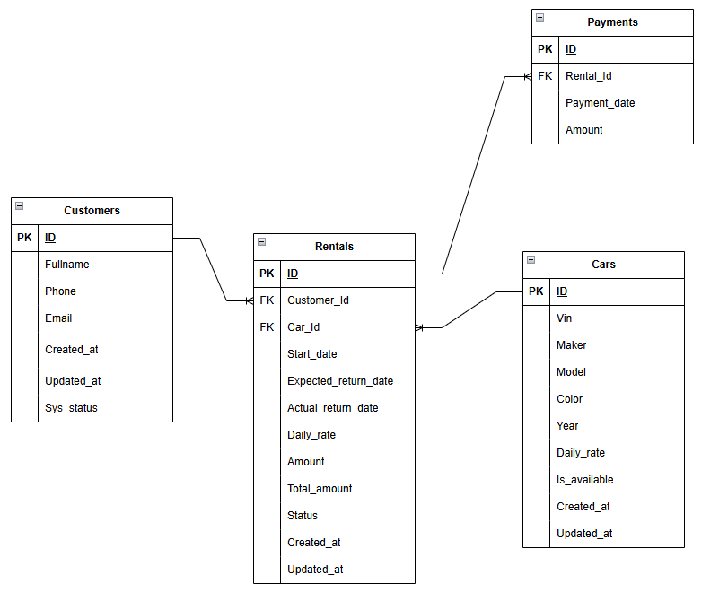

# Carsharing — система аренды автомобилей
# Оглавление

- [Описание проекта](#Описание-проекта)
- [Запуск проекта](#Запуск-проекта)
- [Подключение к базе](#Подключение-к-базе)
---
# Описание проекта
## Краткая сводка

В данном приложении машины арендуются посуточно. Пользователь может иметь только одну активную аренду. Сначала происходит резерв автомобиля, если он доступен, пока не произойдет полная оплата суммы аренды. После полной оплаты пользователю поступит сообщение о активации аренды.

У пользователя есть возможность продлить аренду на n-ое количество дней. В таком случае по окончанию аренды ему выставляется счёт с суммой доплаты.

Если пользователь оканчивает аренду и возвращает автомобиль раньше указанного им срока, то идет перерасчет и оплачиваемые средства за неиспользованные дни возвращаются.

---
## Схема базы данных



## Описание схемы

Таблица Пользователь
-	id serial primary key, -- сурогатный ключ
-	fullname text not null, -- имя
-	phone varchar(10), -- телефон
-	email text not null, -- почта
-	created_at timestamp, -- время создания
-	updated_at timestamp, -- время обновления
-	sys_status int not null. -- системный статус

Таблица Машины
-	id serial primary key, -- сурогатный ключ
-	vin varchar(17) not null, -- идентификатор машины
- maker text not null, -- производитель
- model text not null, -- модель
-	color text, -- цвет
-	year int, -- год выпуска
-	daily_rate numeric(10,2) not null, -- дневная ставка
-	is_available boolean not null, -- достуность авто
-	created_at timestamp,-- время создания
-	updated_at timestamp, --время обновления
-	sys_status int not null. --системный статус

Таблица Аренды
-	id serial primary key, -- сурогатный ключ
-	customer_id int not null, -- id покупателя (внешний ключ)
-	car_id int not null, -- id машины (внешний ключ)
-	start_date date, -- дата начала аренды
-	expected_return_date date not null, -- дата окончания(предварительная)
-	actual_return_date date, -- дата окончания(по факту)
-	daily_rate numeric(10,2) not null, -- дневная ставка(по факту)
-	amount numeric(12,2), -- всего к оплате
-	total_amount numeric(12,2, -- сколько оплачено на данный момент
-	status rental_status not null, -- статус аренды (rental_status - отдельно созданный тип)
-	create_at timestamp, -- время создания
-	updated_at timestamp, -- время обновления

Таблица Платежи
-	id serial primary key, -- сурогатный ключ
-	rental_id int not null, -- id аренды (внешний ключ)
-	payments_date date not null, -- дата оплаты
-	amount numeric(10,2) not null -- количество внесенных средств
---

## Структура проекта
```markdown
carsharing/
├── docker-compose.yml
├── Dockerfile
├── sql/
│ ├── logic/
│ │ ├── customers_logic.sql
│ │ ├── cars_logic.sql
│ │ ├── rentals_logic.sql
│ │ ├── payments_logic.sql
│ │ └── schema.sql
│ ├── init.sql
├── tests/
│ ├── conftest.py
│ ├── test.cars.py
│ ├── test_customers.py
│ ├── test_rentals.py
│ └── test_payments.py
└── README.md
```
---

## Структура тестов

test_cars.py - создание, обновление, удаление машин

test_customers.py — создание, обновление, удаление клиентов

test_rentals.py — аренда, продление, возврат автомобиля

test_payments.py — оплата аренды, переплата, проверка сумм

conftest.py — фикстуры Pytest, очистка БД перед каждым тестом

---

## Запуск проекта

### Требования

| Компонент | Версия |
|------------|--------|
| Docker | 20.10+ |
| Docker Compose | 2.0+ |
| Python | 3.10+ |
| DBeaver / psql | (для подключения к БД) |

---

### Запуск PostgreSQL в Docker

Собери и запусти контейнер с базой данных:

```bash
docker compose up -d --build
```

После запуска:

- создается схема carsharing;
- создаются все таблицы;
- создается вся бизнес-логика;
- выполняются тесты из папки tests.

---

### Подключение к базе данных

| Параметр | Значение |
|------------|--------|
| Host | localhost |
| Port | 5433 |
| Database | carsharing |
| User | postgres |
|Password| postgres |

Можно подключиться через DBeaver, pgAdmin или в терминале:

```bash
docker exec -it carsharing_db psql -U postgres -d carsharing
```
---


